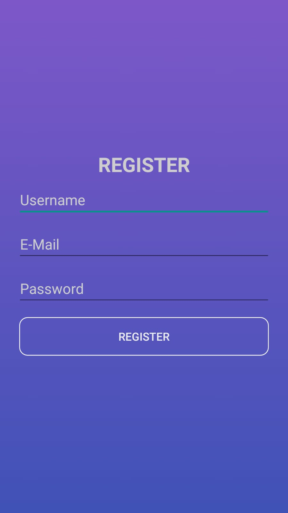
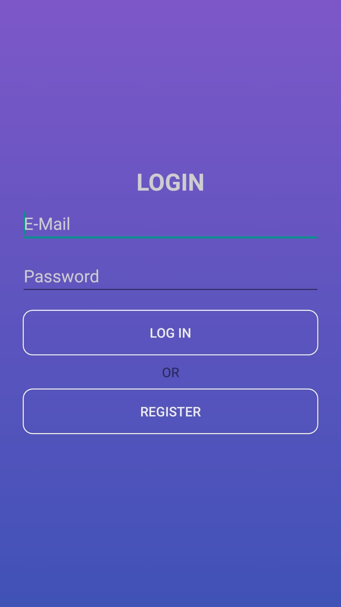
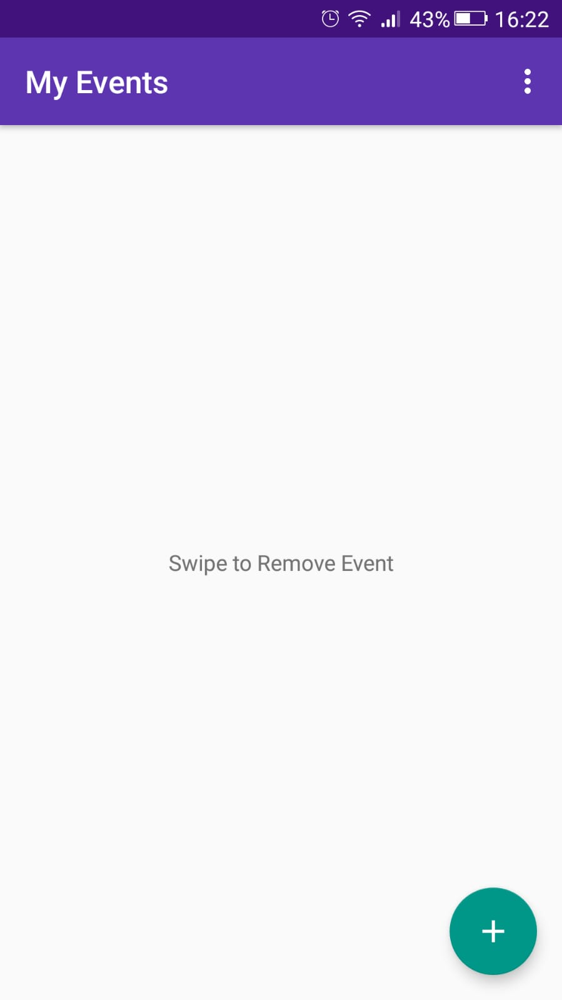
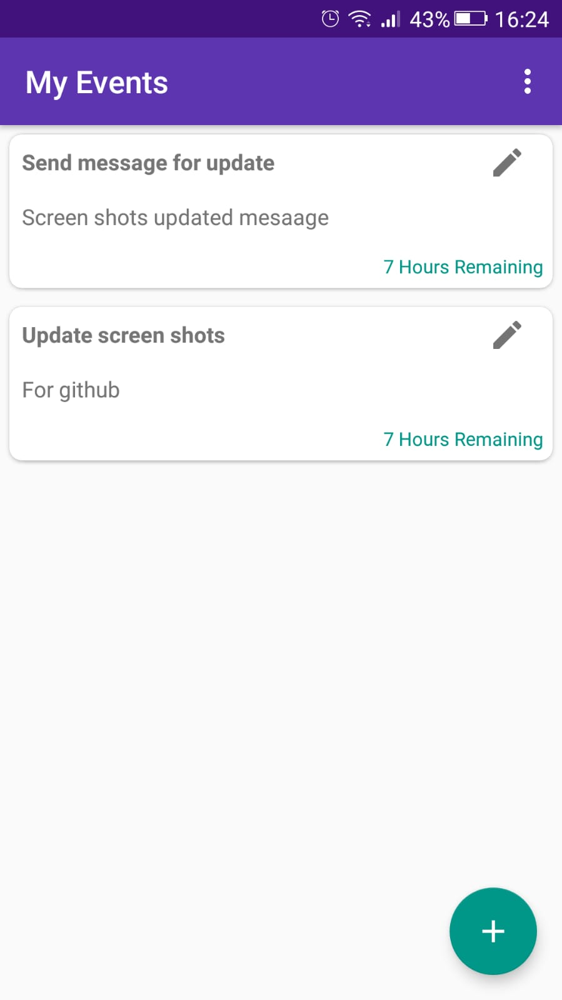
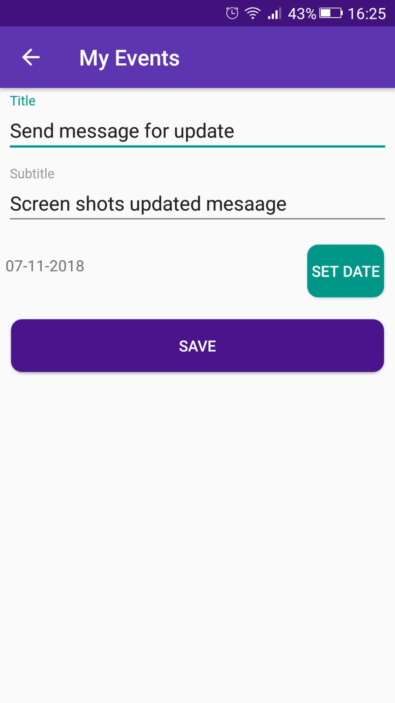
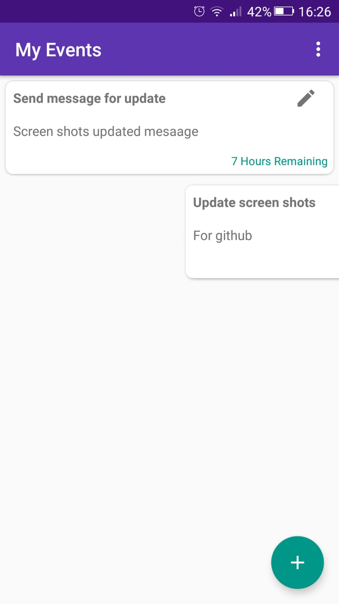

# MyEvents
Simple Room,LiveData sample for Android

<h2>Register Page</h2>

<h2>Login Page</h2>

<h2>Empty Page</h2>

<h2>Events View</h2>

<h2>Add Event Page</h2>

<h2>Swipe And Remove </h2>

